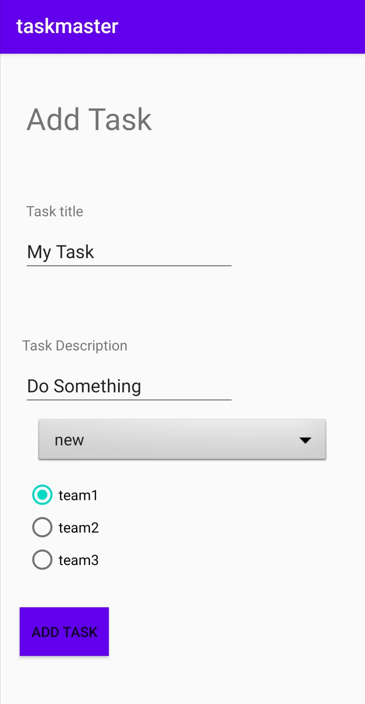

# taskmaster

# Lab: 34 - Related Data

Is to go through the process of publishing to the Google Play Store.

## Feature Tasks
**App Polish**
Ensure that the task master application follows Google’s guidelines.

**Build Final APK**
Build an APK for the task master application. Include that APK in the GitHub repo.

## Deployment to Play Store
`It doesn't deploy due the 25$ registration fee `
In the Google Play Console, follow the checklist for uploading your app to the Play Store. 

## Screen Shots

- *We can add a task.*

<!-- ///
//Final APK added to repo
// Notes on Play deployment in README
// README with description, screenshots, and daily change log -->

## Previous labs documentation

| Lab no.       | Link to the documentation  |         
| ------------|-----------------------------|
|Lab: 26|[Beginning TaskMaster](labs/LAB26.md)|
|Lab: 27|[Data in TaskMaster](labs/LAB27.md)|
|Lab: 28|[RecyclerView](labs/LAB28.md)|
|Lab: 29|[Room](labs/LAB29.md)|
|Lab: 31|[Espresso and Polish](labs/LAB31.md)|
|Lab: 32|[Integrating AWS for Cloud Data Storage](labs/LAB32.md)|
|Lab: 33|[Related Data](labs/LAB33.md)|