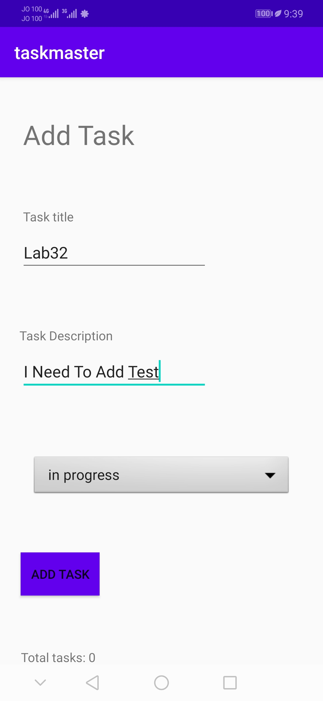
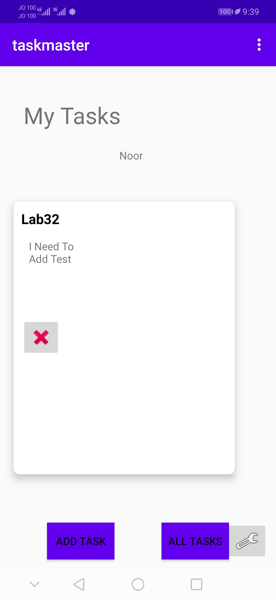
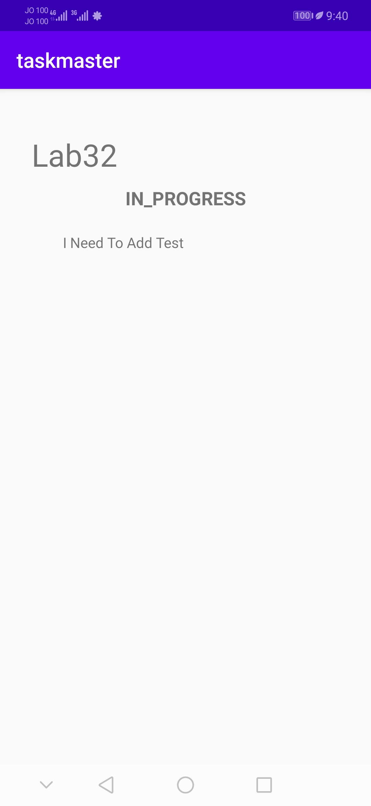
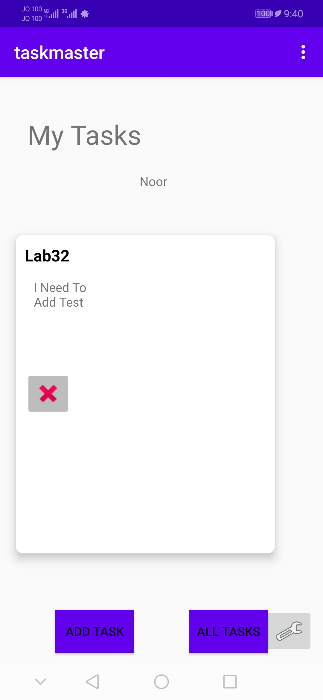
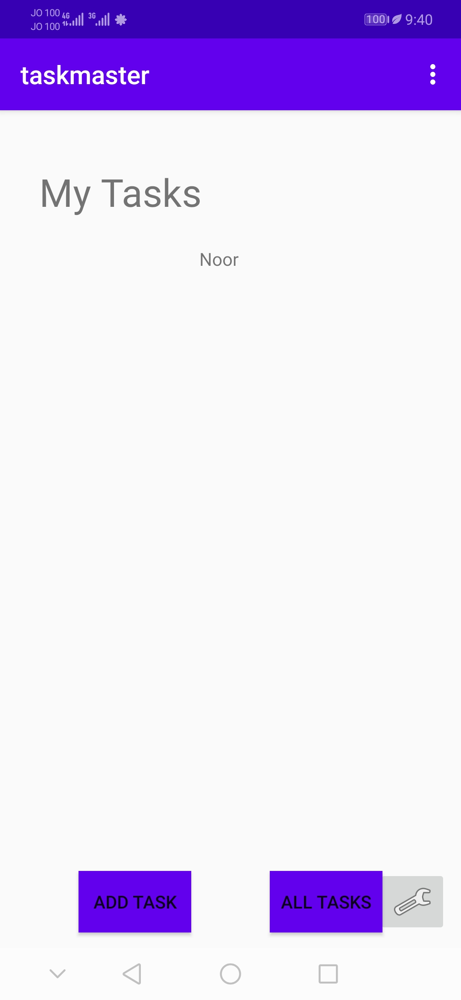

# taskmaster

# Lab: 33 - Related Data

Is to use AWS Amplify as a backend also. 

## Feature Tasks
**Tasks Are Owned By Teams**
- Create a second entity for a team, which has a name and a list of tasks.
So, tasks will be Updated to be owned by a team.

- Manually create three teams.

## Add Task Form
- Modify Add Task form to include either a Spinner or Radio Buttons for which team that task belongs to.

## Settings Page
- In addition to a username, allow the user to choose their team on the Settings page. 

## Testing
Add to your Espresso tests some functionality about the new Team entity.

## Stretch Goals
Cache data fetched from DynamoDB into your local Room database.

2 pts Team entity added with a reasonable structure
2 pts Can add teams and can associate teams with tasks
1 pt Show only the selected team’s tasks on homepage

## Screen Shots
- *We can add a task.*

- *Home page after adding that task*

- *Detail page of that task*

- *Before delete that task*

- *After delete that task*

## Resources
[Amplify Getting Started](https://aws-amplify.github.io/docs/)

## Previous labs documentation

| Lab no.       | Link to the documentation  |         
| ------------|-----------------------------|
|Lab: 26|[Beginning TaskMaster](labs/LAB26.md)|
|Lab: 27|[Data in TaskMaster](labs/LAB27.md)|
|Lab: 28|[RecyclerView](labs/LAB28.md)|
|Lab: 29|[Room](labs/LAB29.md)|
|Lab: 31|[Espresso and Polish](labs/LAB31.md)|
|Lab: 32|[Integrating AWS for Cloud Data Storage](labs/LAB32.md)|
|Lab: 33|[Related Data](labs/LAB33.md)|