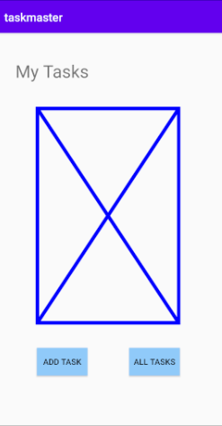
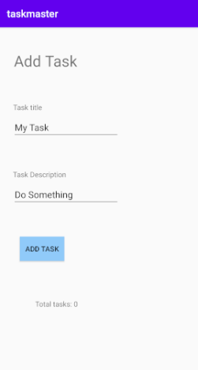
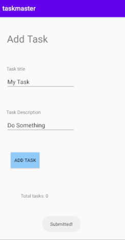
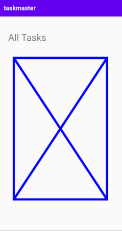

## Lab: 26 - Beginning TaskMaster

### - We were givin wireframes for 3 pages, that are : 

#### 1. **Homepage**
The buttons at the bottom of the page to allow going to the "Add Tasks" and "All Tasks" page.

#### 2. **Add a Task**

When users click the submit button, show a “submitted!” label on the page.

#### 3. **All Tasks**
It needs no functionality.

