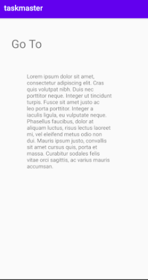
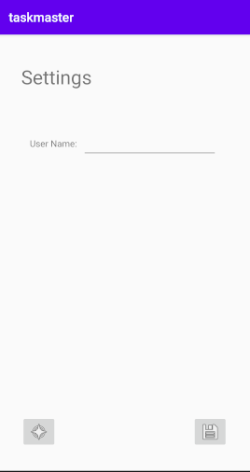
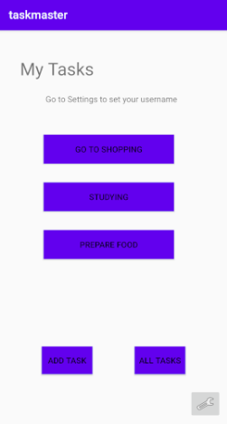

## Lab: 27 - Data in TaskMaster

Is to add the ability to send data among different activities in my application using SharedPreferences and Intents.

### - Feature Tasks : 

#### 1. **Task Detail Page**
Create a Task Detail page. It should have a title at the top of the page, and a Lorem Ipsum description.

#### 2. **Settings Page** 
Create a Settings page. It should allow users to enter their username and hit save.

#### 3. **Homepage** 
The main page should be modified to contain three different buttons with hardcoded task titles. When a user taps one of the titles, it should go to the Task Detail page, and the title at the top of the page should match the task title that was tapped on the previous page.

The homepage should also contain a button to visit the Settings page, and once the user has entered their username, it should display "{username}'s tasks" above the three task buttons.

