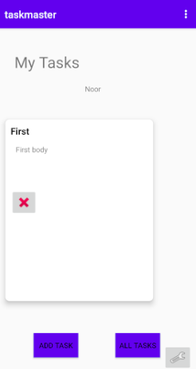
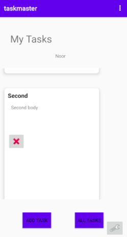
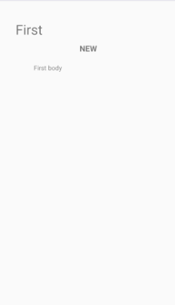
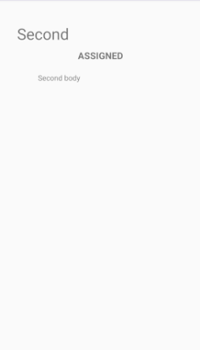

# Lab: 28 - RecyclerView

Is to refactor my homepage, with a RecyclerView full of Task data.

### - Feature Tasks : 

#### 1. **Task Model**
Create a Task class. A Task should have a title, a body, and a state. The state should be one of "new", "assigned", "in progress", or "complete".

#### 2. **Homepage** 
Refactor your homepage to use a RecyclerView for displaying Task data. This should have hardcoded Task data for now.

Some steps you will likely want to take to accomplish this:

Create a ViewAdapter class that displays data from a list of Tasks.
In your MainActivity, create at least three hardcoded Task instances and use those to populate your RecyclerView/ViewAdapter.
Ensure that you can tap on any one of the Tasks in the RecyclerView, and it will appropriately launch the detail page with the correct Task title displayed.

