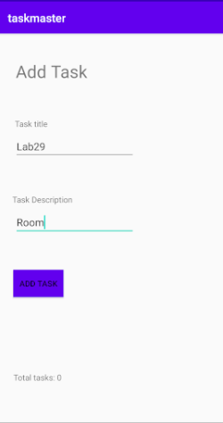
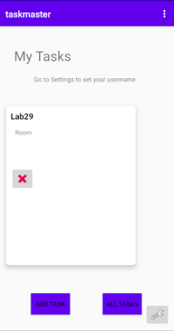
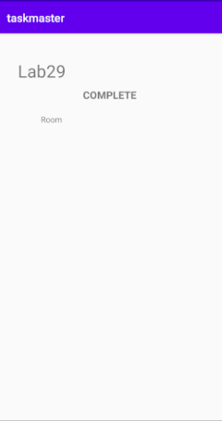

# Lab: 29 - Room
Is to our refactor your model layer to store Task data in a local database.

## - Feature Tasks : 

### 1. Task Model and Room
Set up Room in your application, and modify your Task class to be an Entity.

### 2. Add Task Form
Modify your Add Task form to save the data entered in as a Task in your local database.
  

### 3. Homepage
Refactor your homepage's RecyclerView to display all Task entities in your database.
  

### 4. Detail Page
Ensure that the description and status of a tapped task are also displayed on the detail page, in addition to the title. (Note that you can accomplish this by passing along the entire Task entity, or by passing along only its ID in the intent.)
  

## Testing
Ensure that you have used Espresso to test relevant functionality of your application; for instance, tap on an item on the My Tasks page, and ensure that the correct details are rendered on the Detail page.
