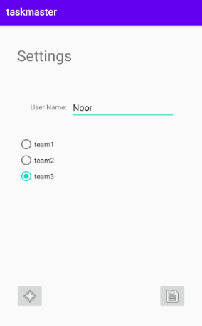
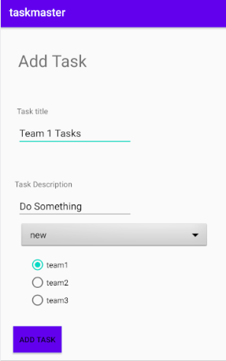
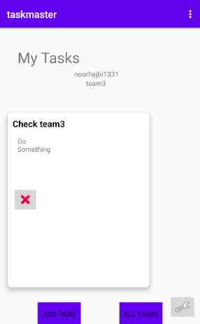

# Lab: 33 - Related Data

Is to use AWS Amplify as a backend also. 

## Feature Tasks
**Tasks Are Owned By Teams**
- Create a second entity for a team, which has a name and a list of tasks.
So, tasks will be Updated to be owned by a team.

- Manually create three teams.

## Add Task Form
- Modify Add Task form to include either a Spinner or Radio Buttons for which team that task belongs to.

## Settings Page
- In addition to a username, allow the user to choose their team on the Settings page. 

## Screen Shots

- *Settings page for adding a username and selecting a team name.*
  

  
- *We can add a task.*
  

  
- *Home page after adding a task*
  
