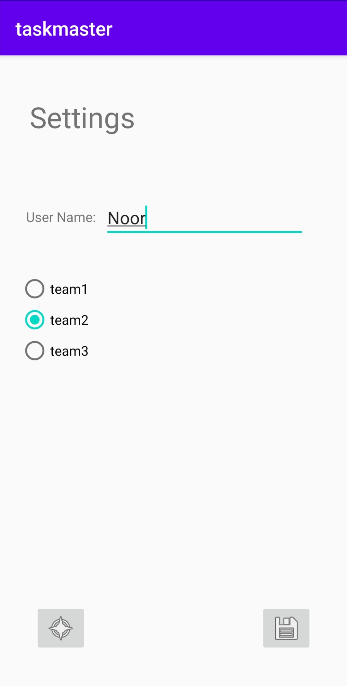
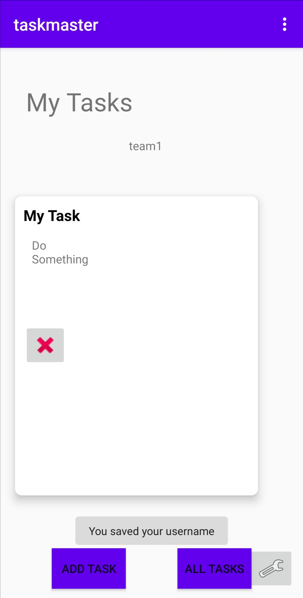
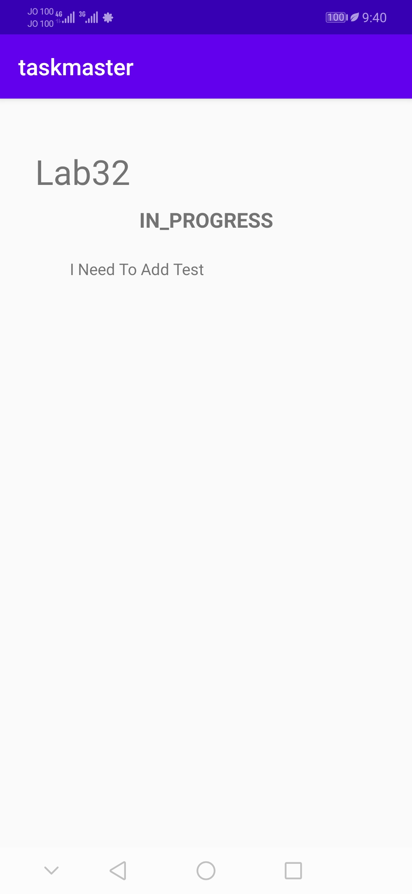
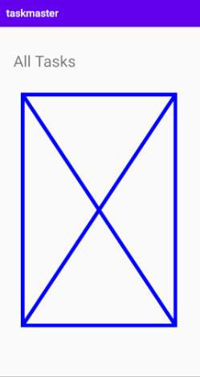

# Lab: 34 - Related Data

Is to go through the process of publishing to the Google Play Store.

## Feature Tasks
**App Polish**
Ensure that the task master application follows Google’s guidelines.

**Build Final APK**
Build an APK for the task master application. Include that APK in the GitHub repo.

## Deployment to Play Store
`I didn't deploy the app due the 25$ registration fee `

In the Google Play Console, follow the checklist for uploading your app to the Play Store.  

## Screen Shots

- *Settings page for adding a username and selecting a team name.*

- *We can add a task.*

- *Home page after adding that task*

- *Detail page of a task*

- *All tasks page*

