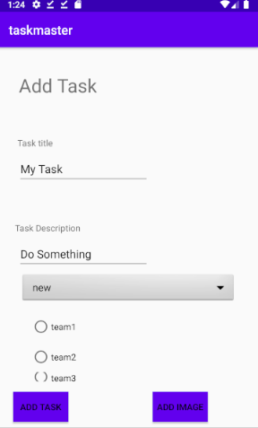
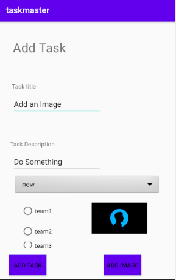
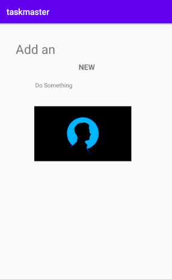

# Lab: 37 - S3
- Is to allow users to upload files related to tasks, like screenshots or log files.

## Feature Tasks

### Uploads
- On the **Add a Task** activity, allow users to optionally select a file to attach to that task.
- If a user attaches a file to a task, that file should be uploaded to **S3**, and associated with that task.

### Displaying Files
- On the Task **detail activity**.
- If there is a file that is an image associated with a particular Task, that image should be displayed within that activity.

## Screen Shots

- *Before Adding a task*  
 

- *After Adding a task*  
 

- *Detail Page*  
 

## Resources:
- [Class37- Demo](https://github.com/joj5/401-TEMP/blob/main/curriculum/class-37/demo)
- [copyStream- code](https://stackoverflow.com/questions/9292954/how-to-make-a-copy-of-a-file-in-android)