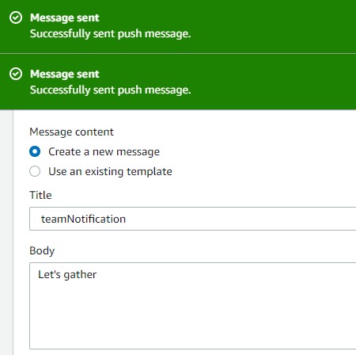
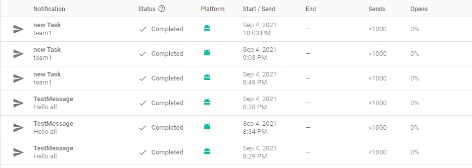
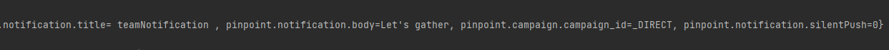

# Lab: 38 - Notifications

- Is to add the ability for push notifications to be delivered to the app from the cloud.

## Feature Tasks

### Notifications on Task Creation

- When a new task is created within a team, alert all users who are a part of that team about that new task.

- There are several steps involved in allowing this to work:
    - Store which team a user is part of in the cloud
    - Add a Lambda trigger on task creation
    - Use SNS to send a notification as part of that Lambda

## Screen Shots

- *Adding AWS push messege*  
 

- *Adding Firebase notification*  
 

- *logcat*  
 

## Resources:
- [Class38- Demo](https://github.com/joj5/401-TEMP/tree/main/curriculum/class-38/demo)
- [Push notifications](https://docs.amplify.aws/sdk/push-notifications/getting-started/q/platform/android/#connect-to-your-backend)