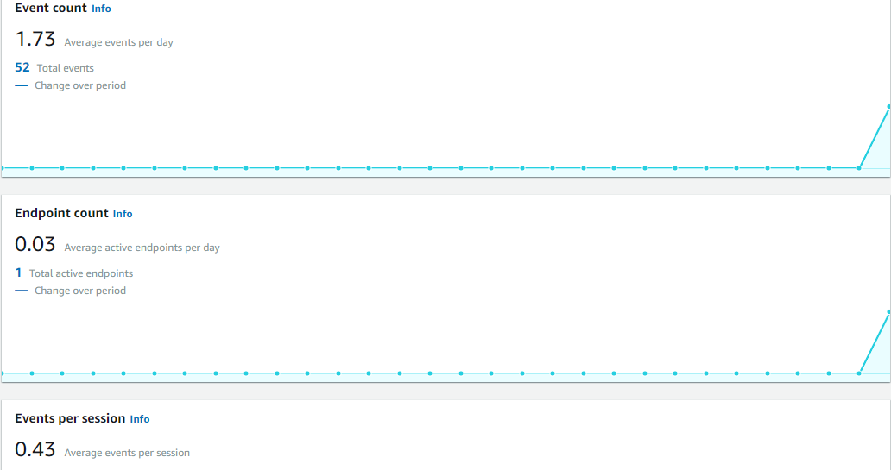

# Lab: 38 - Review

- Is to track users.

## Feature Tasks

### Tracking Users

- Add Analytics to the project. 
- Create and send an event whenever the intents lunch that start new activities.

## Screen Shots

- *Events Dashboard*  
 

## Resources:
- [ANALYTICS](https://docs.amplify.aws/lib/analytics/getting-started/q/platform/android/)