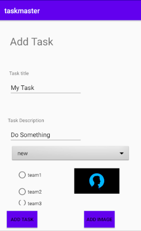

# Lab: 41 - Intent Filters

- Is to allow users to **share** a photo from another app and open TaskMaster, ready to upload that image as part of a new task.

## Feature Tasks

### Adding a Task from Another Application

- Add an intent filter to the application such that a user can hit the **share** button on an image in another application, choose TaskMaster as the app to share that image with, and be taken directly to the Add a Task activity with that image pre-selected.

## Screen Shots

- *Photo from gallery*  
 

- *Getting the photo*  
 

- *Adding the photo to taskmaster*  
 

## Resources:
- [Allowing Other Apps to Start Your Activity- Code from](https://www.youtube.com/watch?v=j2tXsUKSzeI)